# Transformer (from scratch)

Originally introduced in the 2017 paper "Attention is All You Need" (Vaswani et al., 2017), transformers form the structure for most modern large language models, including ChatGPT and Claude. In fact, the GPT in ChatGPT stands for Generative Pre-trained *Transformer*. 

Transformer architecture blends small feed-forward MLPs with attention mechanisms and has been shown "to be superior in quality while being more parallelizable and requiring significantly less time to train" () when compared to previous model designs. 

## Full Notebook
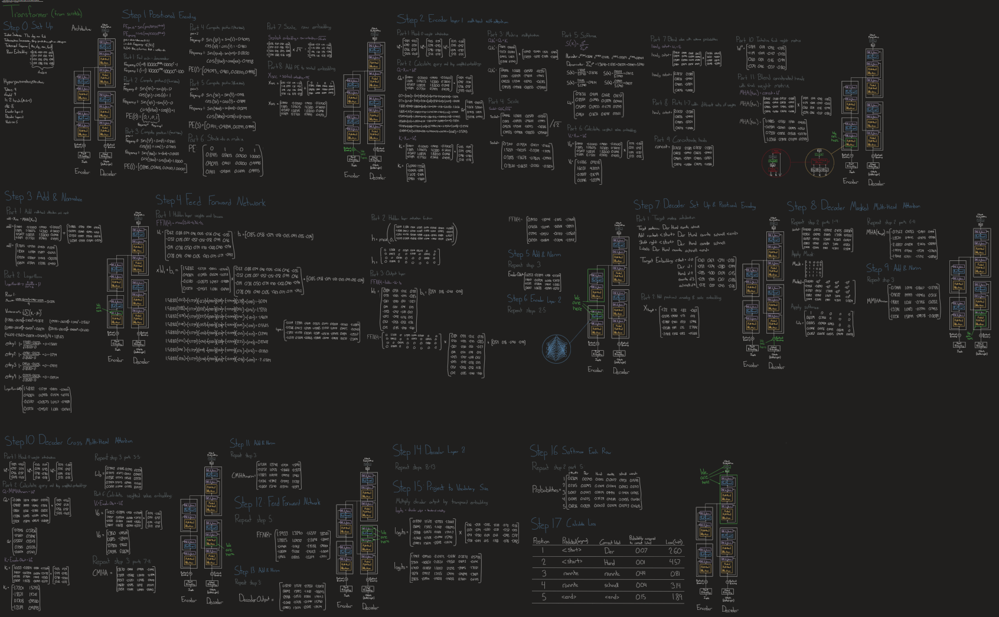

## Step 0: Setup
The transformer that I will be creating is very similar to the one described in "Attention is All You Need" (). It will be used for translating a short English sentence, "The dog ran fast." into German. 

Computers do not understand written language the way humans do, but they do understand numbers. Therefore, we need to translate the initial sentence into a numeric representation. We can do this by breaking up the sentence into different pieces or tokens. In this case, I am just setting everything to lowercase, removing the punctuation, and using the whitespace to determine where to start the next token. This tokenization method results in each token being a word, but there are other methods like subword tokenization that may work better at scale. 

The tokens are then turned into vector embeddings

Looking at the Hyperparameters/Structure, there are 4 initial tokens, and 4 numbers that make up the vector embedding per token (dmodel). As we will see later, each attention block will have 2 heads, and each feed-forward block will have a hidden layer with 8 neurons. I decided to use 2 encoder and 2 decoder layers to show how these layers stack and interact; however, I only did the math for the first layer to avoid repetition. Since this is a translation task, we need the initial vocabulary and the vocabulary of the language we are translating to. In this case, the English vocab size is 4, and the German's is 6. That means there is just enough for the German translation and for the <start> and <end> tags.

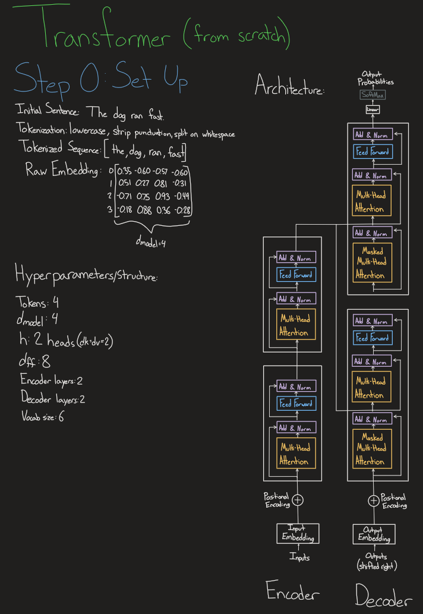

The architecture on the right side of Step 0 is a representation of the original figure from "Attention is All You Need" and will be used throughout this example to show where we are in the process. 

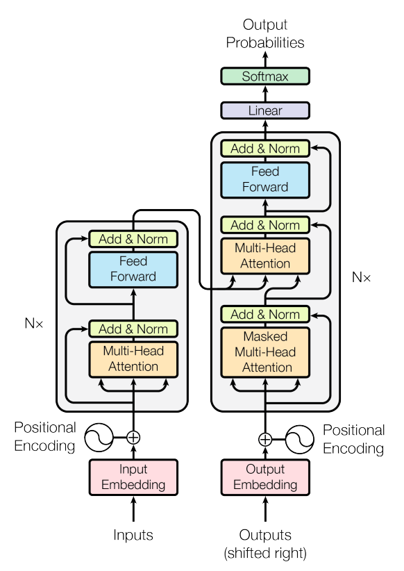

**Orginal figure from "Attention is All You Need"*

## Step 1: Positional Encoding

The raw embedding now contains learnable parameters that represent the semantic meaning of each token, but they do not have any context for where the tokens are positioned in the sequence. For this, we need to add positional encoding. The most obvious way to do this would be to have a sequence from 1 to n tokens and just add that to the embedding. However, if there is a 1,000-word sequence, then you would be completely overriding the original embedding signal with massive positional encoded values. Instead, we can use sinusoidal positional encoding, which is also used in the paper. This method uses sine and cosine pairs; each set of pairs changes at different rates, which act similarly to the hands of a clock. If you have 2 pairs, you can think of these as the minute and hour hands of a clock, where the first pair changes at a much faster rate than the second. So while position 10 might look similar to position 110 on the first pair, the added context of the lower-frequency second pair is enough to differentiate them. This method allows us to add positional context within the bounds of the raw embeddings to retain signal from both. The formula used to create these encodings in the paper is shown below:

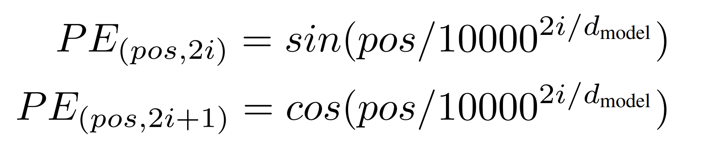

For this example, we will have 2 pairs, or "hands," which add up to the dmodel of 4. We will call these frequency 0 and 1, as seen in Part 1. These frequencies have denominators of 1 and 100, respectively. With the frequency denominators calculated, we can now find the sine and cosine values for each token position, as seen in parts 2-5. Then those pairs are concatenated and stacked into a matrix. As you can see from the first pair in Part 6, the values vary significantly from row to row, yet the second pair changes much more gradually between rows. This relationship is shown on the graph below:

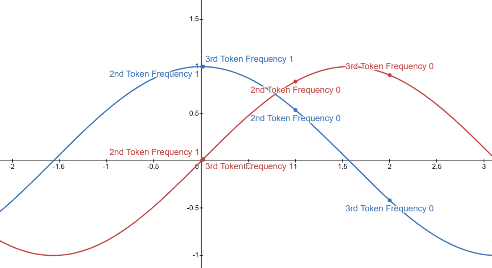

As you can see from the graph, the difference between tokens 2 and 3 is clearly visible for frequency 0, and the points for tokens 2 and 3 practically overlap for frequency 1.

Before the positional encodings are added to the embedding, we scale the embeddings by the square root of the model dimensions as shown in Part 7. This ensures the initial embedding signal is larger and therefore less likely to be overshadowed by the positional encoding. Then in Part 8, we add the scaled embedding and the positional encoding using element-wise addition. This just means that position [0][0] of the scaled embedding is added to the corresponding position of the positional encoding, for example. In the next step, we will see a way to blend matrices that is a little more complicated.

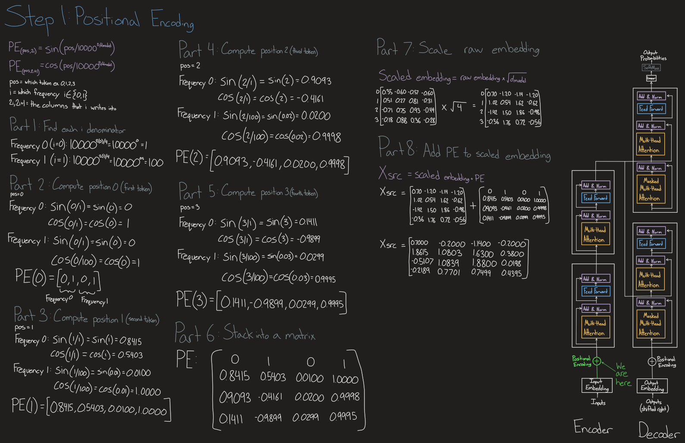

## Step 2: Encoder Layer 1 Multi-Head Self-Attention

Now that our matrix has information on the positional and semantic context of each token, we can pass it into the first Multi-Head Attention block. Attention is basically seeing how much one word should pay *attention* to another word in the sequence and then using that importance to create a new representation of the text. We can do this by constructing 3 vectors called Queries (Q), Keys (K), and Values (V). The Query for one word "looks" for compatible words using the other words' Keys. Different attention heads "look" for different things because we use different Query, Key, and Value vectors for each attention head. An example of this Multi-Head attention system on a piece of text would be if you had a sentence "The King and Queen baked a cake for their son and daughter"; one attention head might have queries that look for gender information, therefore giving King-son and Queen-daughter query-key pairs larger dot products. Another attention head could find the similarity between baked-cake, or between nouns and verbs.

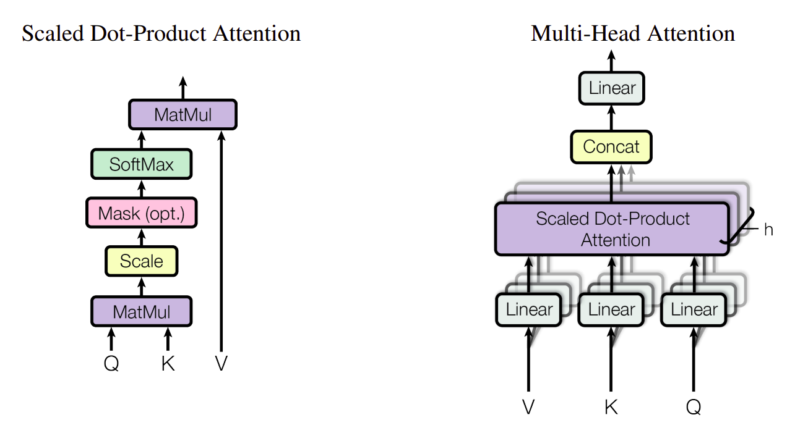

The weight initialization for the Queries, Keys, and Values is shown in Part 1. The shape of these matrices depends on the shape of Xsrc from the previous step. When multiplying 2 matrices together, the inside dimensions have to be the same. For example, (2x4 * 4x2) works, but (2x4 * 2x4) does not. Therefore, the number of rows for these weight matrices needs to be the same as the number of columns of Xsrc, which is also dmodel (4). The number of columns then needs to be 1/2 of dmodel, making these weight matrices 4x2.

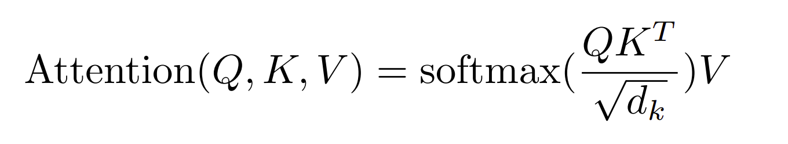

Moving on to Part 2, the Query and Key matrices are combined with Xsrc to create the blended Query and Key values. We combine them using matrix multiplication, which is written out in full for Q0. These combined matrices take the Xsrc signal and emphasize certain values using the weights. In Part 3, we combine the Q0 and K0 matrices, but first the Keys need to be transposed to make the matrix multiplication work. The larger positive values in this combined matrix mean there is more of a "connection" between the queries and keys. In Part 4, we scale this combined matrix by the square root of the dimension of the keys to prevent exploding values.

Softmax functions are really good at compressing values into probabilities, which is exactly what happens in Part 5. This results in a matrix of row-by-row probabilities that show the importance of each dimension. This is used to scale the Values by emphasizing the values with the most signal and punishing the values with little signal.

The Values weights are blended with Xsrc in Part 6, just like we did for the Queries and Keys in Part 2. This step could be done in Step 2, but I decided to split them up because we haven't needed the Values until this point.

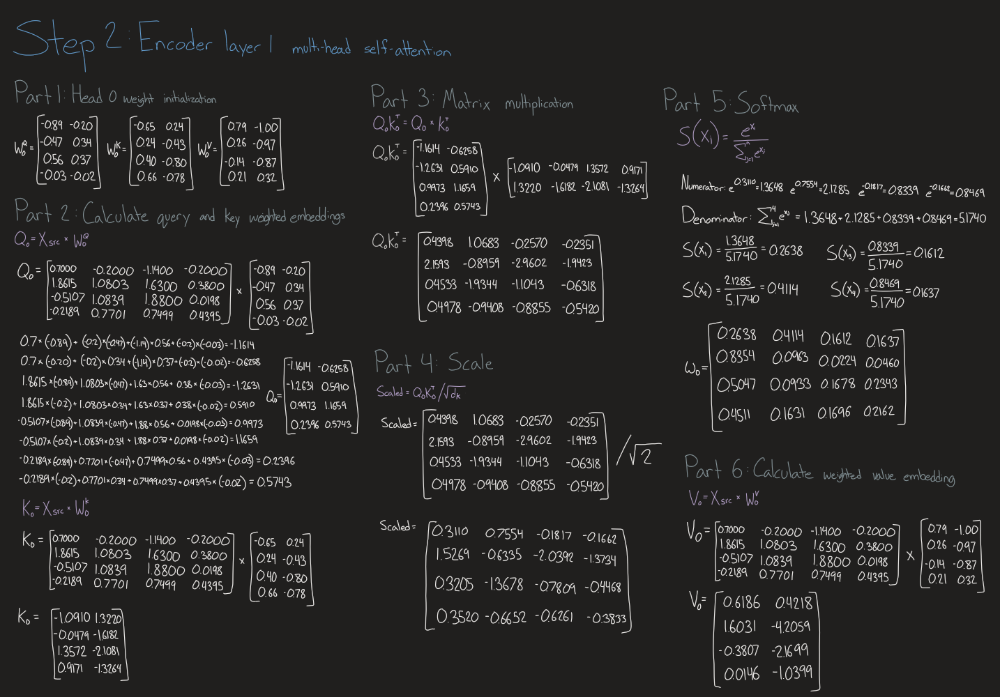

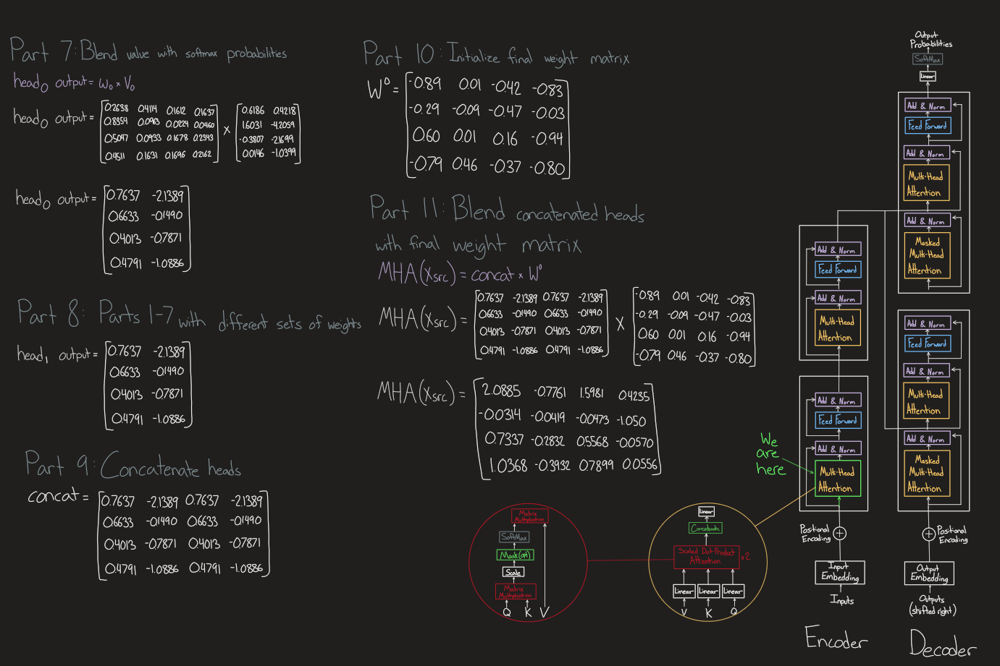

## Step 3:
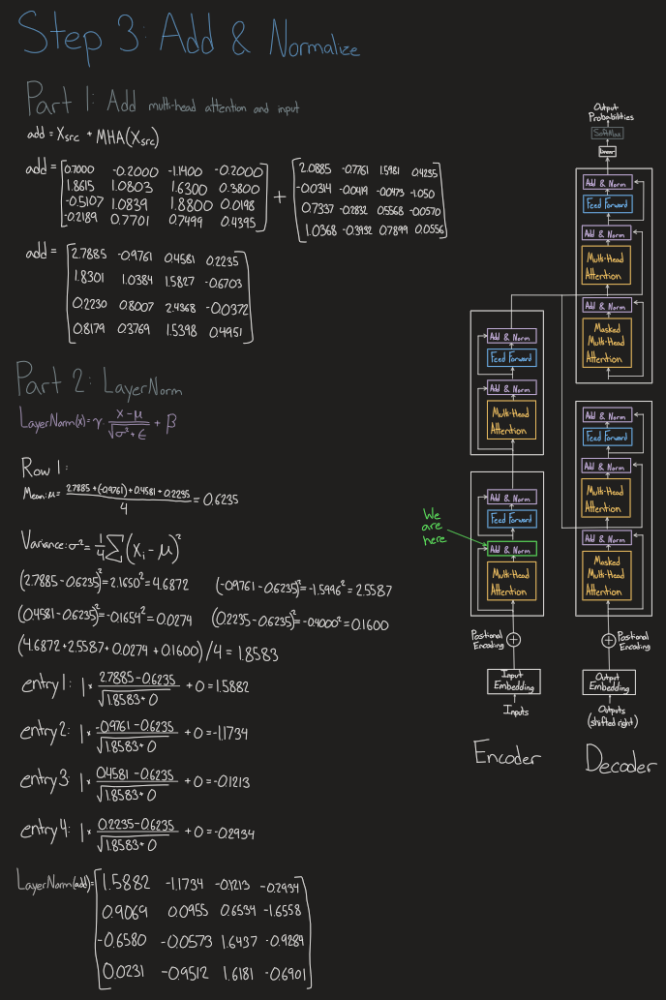

## Step 4-6:
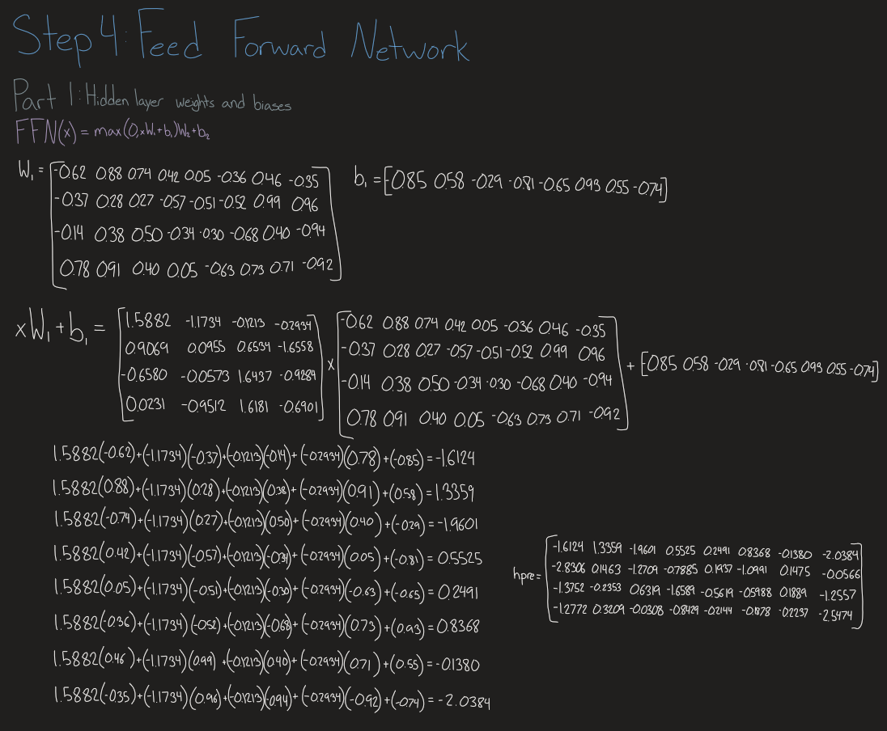

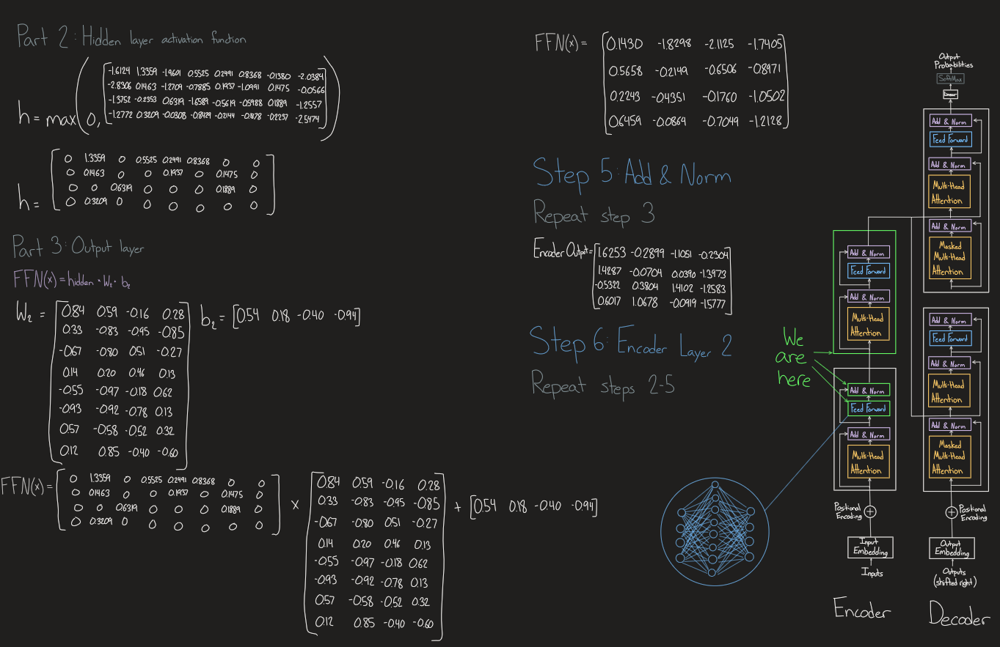

## Step 7:
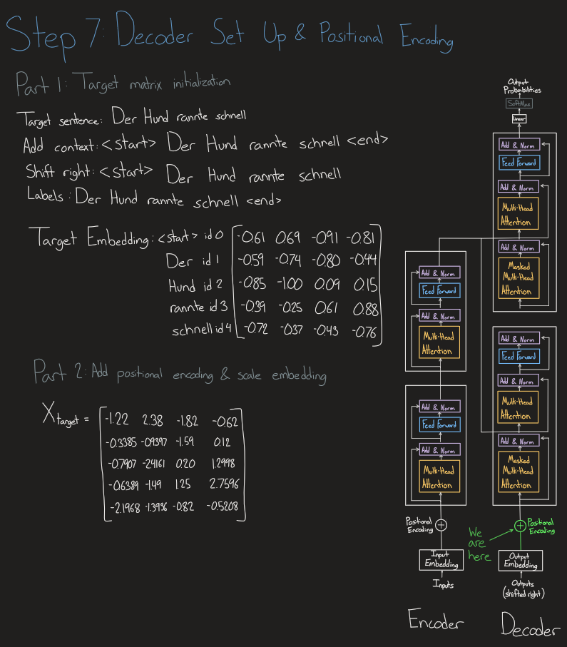

## Step 8-9:
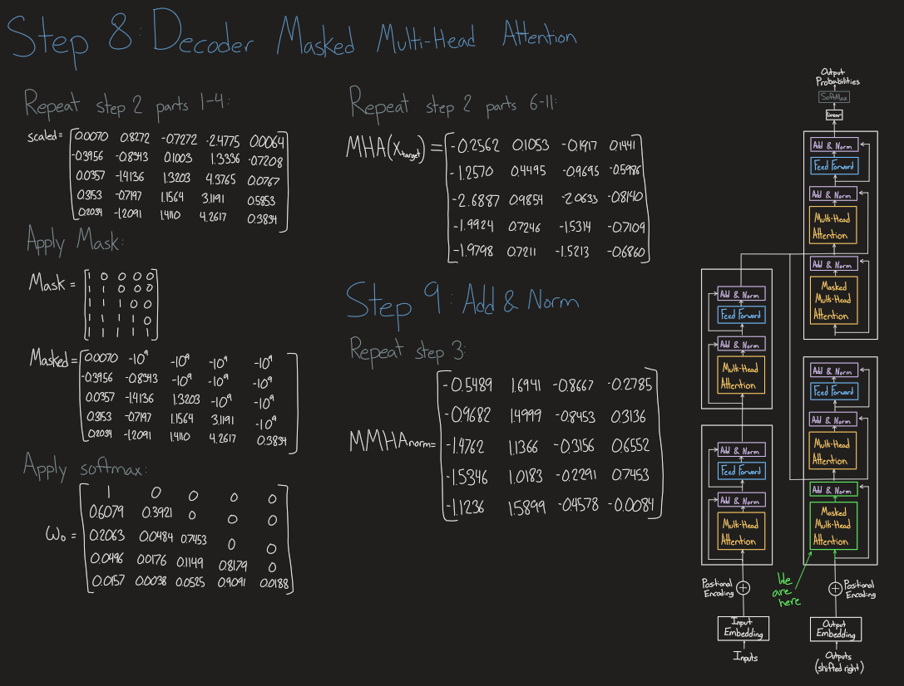

## Step 10:
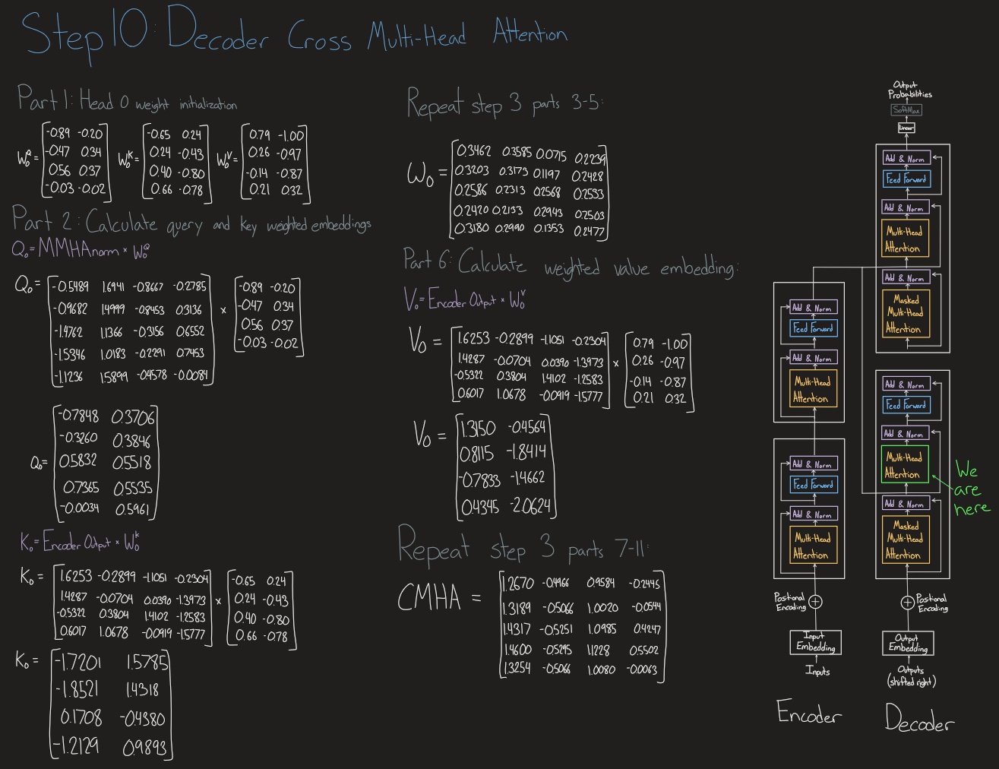

## Step 11-13:
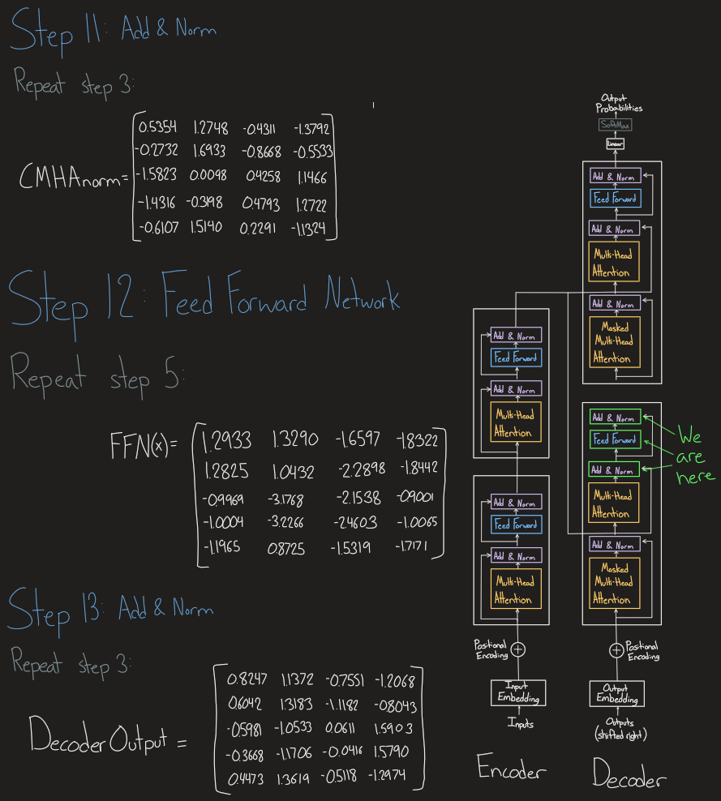

## Step 14-15:
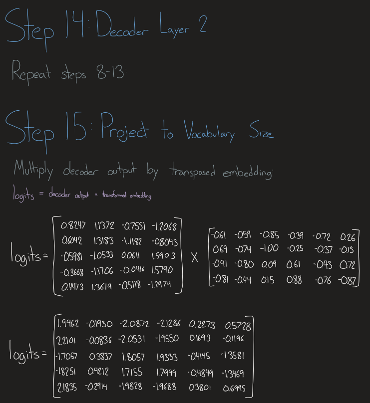

This example does not include backpropagation, 
## Step 16:
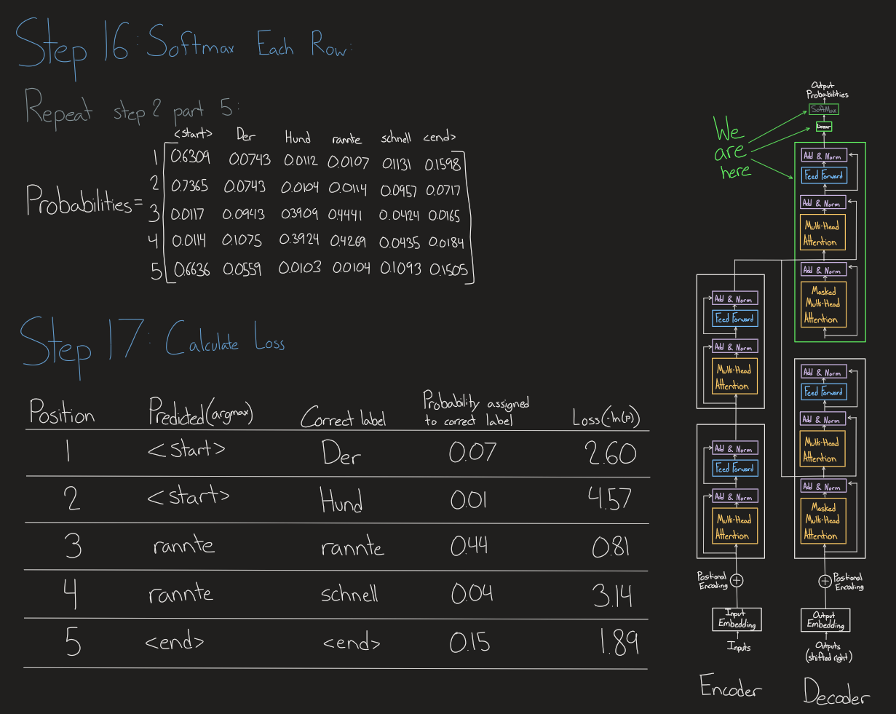
