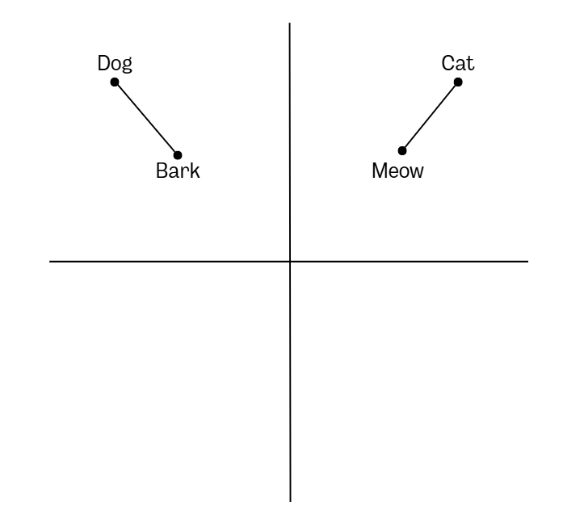
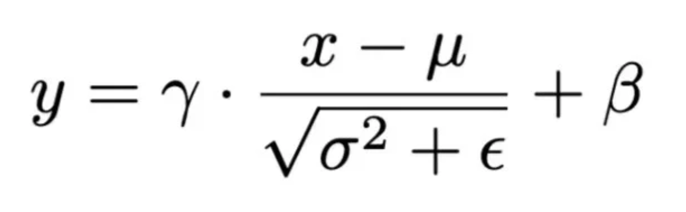
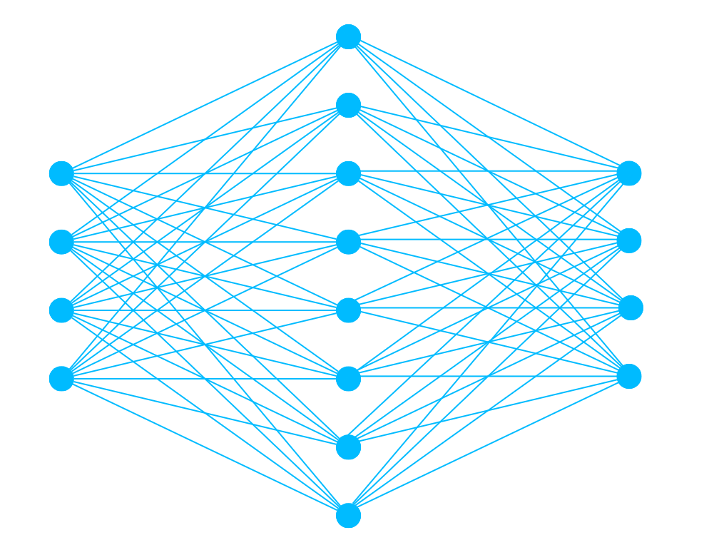
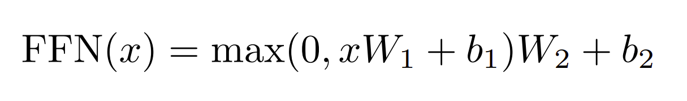
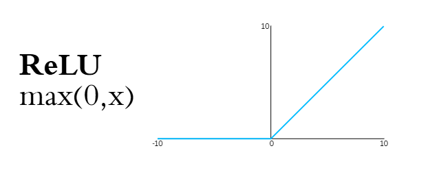

# Transformer (from scratch)

Originally introduced in the 2017 paper "Attention is All You Need" (Vaswani et al., 2017), transformers form the structure for most modern large language models, including ChatGPT and Claude. In fact, the GPT in ChatGPT stands for Generative Pre-trained *Transformer*. 

Transformer architecture blends small feed-forward MLPs with attention mechanisms and has been shown "to be superior in quality while being more parallelizable and requiring significantly less time to train" (Vaswani et al., 2017) when compared to previous model designs. 

## Full Notebook

  

## Step 0: Set Up
The transformer that I will be creating is very similar to the one described in "Attention is All You Need" (Vaswani et al., 2017). It will be used for translating a short English sentence, "The dog ran fast." into German. 

Computers do not understand written language the way humans do, but they do understand numbers. Therefore, we need to translate the initial sentence into a numeric representation. We can do this by breaking up the sentence into different pieces or tokens. In this case, I am just setting everything to lowercase, removing the punctuation, and using the whitespace to determine where to start the next token. This tokenization method results in each token being a word, but there are other methods like subword tokenization that may work better at scale. 

The tokens are then turned into vector embeddings to complete the transformation from language to numbers. A vector represents magnitude and direction. In this case, the vectors that describe each token are a series of numbers that position the token in an embedding space. This space could have anywhere from 1 to infinite dimensions, where each dimension represents a different part of context, though in practice the dimensions are learned and not always human-interpretable. An example of this vector space is shown in Figure 1. You can also use these vectors in equations. For example, Dog - Bark + Meow = Cat.

  

Figure 1: Vector Embedding Example.

Looking at the Hyperparameters/Structure, there are 4 initial tokens and 4 dimensions that make up each vector embedding (dmodel). As we will see later, each attention block will have 2 heads, and each feed-forward block will have a hidden layer with 8 neurons. I decided to use 2 encoder and 2 decoder layers to show how these layers stack and interact; however, I only did the math for the first layer to avoid repetition. Since this is a translation task, we need the initial vocabulary and the vocabulary of the language we are translating to. In this case, the source (English) vocab size is 4, and the target (German) vocab size is 6. That means there is just enough for the German translation and for the `<start>` and `<end>` tags needed for the decoder.

  

The architecture on the right side of Step 0 is redrawn digitally in Figure 2 below, and will be used throughout this example to show where we are in the process. As seen in the figure, there are both encoder and decoder layers. This works well for translation tasks because it separates the understanding from the predicting. Language has lots of nuances that often require future context to fully understand. For example, in this sentence, "ran" is used to indicate the dog is quickly moving from point A to B. Meanwhile, if the sentence was instead "The dog ran the lemonade stand", or "The dog ran for mayor", the meaning of "ran" would be different. The encoder is able to look at every token in the sequence at once, including words that come after "ran", which can be used to determine the correct meaning of the word. The encoder then passes what it's learned to the decoder via cross-attention, where the decoder processes that additional context and makes a prediction for the translated sequence.

  

Figure 2: Original Figure from "Attention is All You Need" (Vaswani et al., 2017).

## Step 1: Positional Encoding

The raw embedding now contains learnable parameters that represent the semantic meaning of each token, but they do not have any context for where the tokens are positioned in the sequence. For this, we need to add positional encoding. The most obvious way to do this would be to have a sequence from 1 to n tokens and just add that to the embedding. However, if there is a 1,000-word sequence, then you would be completely overriding the original embedding signal with massive positional encoded values. Instead, we can use sinusoidal positional encoding, which is the method used in the paper. This method uses sine and cosine pairs; each set of pairs changes at different rates, which act similarly to the hands of a clock. If you have 2 pairs, you can think of these as the minute and hour hands of a clock, where the first pair changes at a much faster rate than the second. So while position 10 might look similar to position 110 on the first pair, the added context of the lower-frequency second pair is enough to differentiate them. This method allows us to add positional context within the bounds of the raw embeddings to retain signal from both. The formula used to create these encodings in the paper is shown in Figure 3.

  

Figure 3: Sinusodial Positional Encoding Formula.

For this example, we will have 2 pairs, or "hands," which add up to the dmodel of 4. We will call these frequency 0 and 1, as seen in Part 1. These frequencies have denominators of 1 and 100, respectively. With the frequency denominators calculated, we can now find the sine and cosine values for each token position, as seen in parts 2-5. Then those pairs are concatenated and stacked into a matrix. As you can see from the first pair in Part 6, the values vary significantly from row to row, yet the second pair changes much more gradually between rows. This relationship is shown in Figure 4.

  

Figure 4: Positional Encoding Graph.

As you can see from the graph, the difference between tokens 2 and 3 is clearly visible for frequency 0, and the points for tokens 2 and 3 practically overlap for frequency 1.

Before the positional encodings are added to the embedding, we scale the embeddings by the square root of the model dimensions as shown in Part 7. This ensures the initial embedding signal is larger and therefore less likely to be overshadowed by the positional encoding. Then in Part 8, we add the scaled embedding and the positional encoding using element-wise addition. For example, position [0][0] of the scaled embedding is added to the corresponding position of the positional encoding. In the next step, we will see a way to blend matrices that is a little more complicated.

  

## Step 2: Encoder Layer 1 Multi-Head Self-Attention

Now that our matrix has information on the positional and semantic context of each token, we can pass it into the first Multi-Head Attention block. Attention is basically seeing how much one word should pay *attention* to another word in the sequence and then using that importance to create a new representation of the text. We can do this by constructing 3 vectors called Queries (Q), Keys (K), and Values (V). The Query for one word "looks" for compatible words using the other words' Keys. Different attention heads "look" for different things because we use different Query, Key, and Value vectors for each attention head. An example of this Multi-Head attention system on a piece of text would be if you had a sentence "The King and Queen baked a cake for their son and daughter"; one attention head might have queries that look for gender information, therefore giving King-son and Queen-daughter query-key pairs larger dot products. Another attention head could find the similarity between baked-cake, or between nouns and verbs.

  

Figure 1: Vector Embedding Example.

The weight initialization for the Queries, Keys, and Values is shown in Part 1. The shape of these matrices depends on the shape of Xsrc from the previous step. When multiplying 2 matrices together, the inside dimensions have to be the same. For example, (2x4 * 4x2) works, but (2x4 * 2x4) does not. Therefore, the number of rows for these weight matrices needs to be the same as the number of columns of Xsrc, which is also dmodel (4). The number of columns then needs to be 1/2 of dmodel, making these weight matrices 4x2.

  

Figure 1: Vector Embedding Example.

Moving on to Part 2, the Query and Key matrices are combined with Xsrc to create the blended Query and Key values. We combine them using matrix multiplication, which is written out in full for Q0. These combined matrices take the Xsrc signal and emphasize certain values using the weights. In Part 3, we combine the Q0 and K0 matrices, but first the Keys need to be transposed to make the matrix multiplication work. The larger positive values in this combined matrix mean there is more of a "connection" between the queries and keys. In Part 4, we scale this combined matrix by the square root of the dimension of the keys to prevent exploding values.

Softmax functions are really good at compressing values into probabilities, which is exactly what happens in Part 5. This results in a matrix of row-by-row probabilities that show the importance of each dimension. This is used to scale the Values by emphasizing the values with the most signal and punishing the values with little signal.

The Values weights are blended with Xsrc in Part 6, just like we did for the Queries and Keys in Part 2. This step could be done in Step 2, but I decided to split them up because we haven't needed the Values until this point.

  

We can now use the probabilities from Step 5 and multiply them by the blended Values matrix. This output is the first head of the Multi-Head attention block. In this example, we have 2 heads of attention because the number of heads is equal to the dimensions of dk as outlined in Step 0. We can repeat Parts 1-7 with different Query, Key, and Value weight matrices to get the second head. In this example, I have just used the same weights for the second head so as not to clutter this step with repetition. Once we have the 2 heads, then we just concatenate them so that they fit side by side. We use one final weight matrix on this concatenated set. This blends the insights from the different heads and ensures the correct dimensions, which are needed for the next step.

  

## Step 3: Add & Normalize

In this step, we will use the Add & Normalize block, which is used for every attention and feed-forward sublayer in this architecture. The purpose of this block is to retain some of the original signal and to limit exploding/shrinking values. In Part 1, we add the input used for the Multi-Head Attention block (Xsrc) to the Multi-Head Attention output. Since we randomly initialized the weights in the Multi-Head Attention block, there is a chance that the output is some nonsensical mess that doesn't contain any helpful information. By adding the input, we ensure that the original signal remains, which is especially important early in training when the weights have not gotten the chance to "learn". 

The normalizing portion of this block in Part 2 helps to keep values in check. During training, values can grow too large or shrink too small. LayerNorm contains these values using the equation below.

  

Figure 1: Vector Embedding Example.

The full calculations for normalizing the first row are shown in Part 2. 

  

## Step 4-6: Feed Forward Network

  

Figure 1: Vector Embedding Example.

We can now use the outputs from the Multi-Head Attention + Add & Norm sublayer as inputs for a feed-forward network. As described in my [MLP Walkthrough](https://github.com/clippie/Walkthrough_MLP_from_Scratch/tree/main), the feed-forward network learns deeper, non-linear features for each word. Feel free to check out my walkthrough to learn more about how the foundations of a multilayer perceptron work.

  

We determined in the setup that there would be 8 hidden neurons (dff=8). In practice, this looks like an 8x4 matrix of learnable weights for the hidden layer and an 8x1 list of biases. Each row of the inputs is dot-producted by each column of the weights matrix, and then the corresponding biases are added. This would be drawn to look like Figure X with 4 different inputs and weights for each neuron. The calculations for the hidden layer are in Part 1.

  

Then we use an activation function to introduce non-linearity in Part 2. For this example, I am using ReLU (shown in Figure x), which is quite simple to implement. Any positive  value is kept, and the negative values are set to 0. This ensures that the model has added complexity and cannot be reduced to a single linear equation. This concludes the hidden layer, and we can now move to the output layer outlined in Part 3. For the output layer, we use a separate weight matrix with 8x4 dimensions, which results in a 4x4 output that matches the input dimensions. We can then apply the add and normalize block to the output just like we did in step 3. 

  

This whole process from steps 2-5 is repeated for the encoder's second layer using the output from the first encoder layer as the input for the second. In the paper, they use 6 encoder layers, so you would repeat this process 5 more times. Here I am only using 2 layers to show how they interact and stack with each other. I purposely use the same output from the first encoder layer as the output for the second to avoid repetition while still showing how multiple layers work.

  

## Step 7: Decoder Set Up & Positional Encoding
This transformer will be used for a translation task, which is one of the applications the paper uses. The translation we are looking for is "Der Hund rannte schnell". We also add context to let the model know when it can start and end the sequence. We shift the sequence right by adding the <start> token to the beginning. The model predicts the next token using the previous tokens as context. By shifting the sequence to the right, we are setting up teacher forcing, where the model uses the previous ground truth token from the training data as input instead of the token it predicted. These tokens are given the same type of embedding as the original English input. This embedding is scaled and combined with positional encoding, just like we did in Step 1.

  

## Step 8-9: Decoder Masked Multi-Head Attention
One of the key differences between the encoder and decoder layers is that the decoder is autoregressive, meaning it cannot know the full context like the encoder layer; instead, it is only allowed the context up to the token that is predicted. That means we have to hide the future context from the model. This can be done by inserting a mask between the scaling and softmax portion of each attention head. This mask sets all the forbidden values to negative infinity, which is turned into 0s by the softmax function and pushes all importance to the allowed context.

The rest of the Multi-Head Attention block works the same as in Step 2, parts 6-11, and the output is sent through an Add & Norm block just like in Step 3.

  

## Step 10: Decoder Cross Multi-Head Attention
A second Multi-Head Attention layer is used to combine the outputs from the encoder and the first Multi-Head Attention sublayer. This process is identical to the non-masked Multi-Head Attention sublayer used in the encoder layers, except for the inputs blended with the weights. Here I am using the same weights from the encoder layer to reduce arbitrary numbers. The Query weights are combined with the output from the masked multi-head attention sublayer in the decoder. The Key and Value weights are combined with the encoder output, connecting the 2 sides of the transformer. 

  

## Step 11-13:
The output from the cross multi-head attention is sent through another add & norm block, a feed-forward neural network, and another add & norm block to complete the first decoder layer.

  

## Step 14-15:
Just like for the second encoder layer, I am using the output from the first decoder layer as the input for the second decoder layer. This is just to show how different layers stack without repeating concepts. The second decoder layer uses the output from the first decoder layer as input and the output from the second encoder layer as input for the cross-attention multi-head attention.

In Step 15, we take the final decoder output and multiply it by the transposed German embedding, including the `<start>` and `<end>` tags. This gives us a 5x6 matrix with 5 rows for each position (Der Hund rannte schnell `<end>`) and 6 columns for each available token in the vocabulary (`<start>` Der Hund rannte schnell `<end>`).

  

## Step 16:
After applying the softmax function to each row, we are left with probabilities for each token for each position in the sequence. Now, if we just take the highest probability option for each position, we get our predicted sentence (`<start>`, `<start>`, rannte, rannte, `<end>`). We can then determine the loss by taking the minus natural log of the probability assigned to the correct label. Higher loss values mean there was more of an error. As you can see from the table in Step 17, position 2 was the most inaccurate, with only a 0.01 probability assigned to the correct label. Position 3, on the other hand, successfully predicted "rannte" as the correct word with a 0.44 probability, leading to a loss of only 0.81. Now this is a very crude example, and these results are more a product of luck than anything else. This model would have to ingest many more training examples and go through backpropagation, adjusting all the learnable parameters throughout the model to get a more accurate and generalized model.

  

This example does not include backpropagation, 

---

© Caden Lippie 2026. Licensed under [Creative Commons Attribution 4.0 International](https://creativecommons.org/licenses/by/4.0/).
